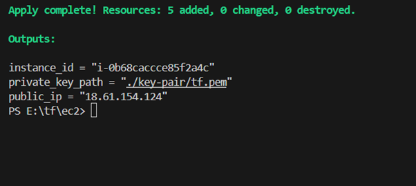
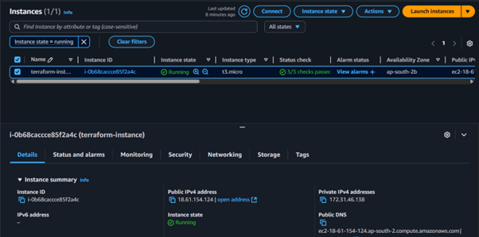

# 🚀 Terraform EC2 Instance Provisioning with Key Pair, Security Group, and User Data

This project uses **Terraform** to provision one or more EC2 instances on **AWS**, complete with:
- A dynamically generated **SSH key pair**
- A **security group** with open ports (22, 80)
- Optional **user data** for bootstrapping
- Optional **EBS volume customization**
- Multi-instance support using `for_each` or `count`

---

## 📁 Project Structure

```
terraform-ec2-project/
├── main.tf              # Main Terraform configuration
├── variables.tf         # Input variables
├── outputs.tf           # Output values
├── terraform.tfvars     # Values for variables
├── user_data.sh         # Optional script run at EC2 launch
├── key-pair/            # Directory where private key will be stored
├── .gitignore           # Ignores sensitive/generated files
└── README.md            # Project documentation
```

---

## ⚙️ Requirements

- [Terraform](https://developer.hashicorp.com/terraform/install)
- An AWS account and IAM user with EC2 permissions
- AWS credentials configured via:
  - `~/.aws/credentials`, or
  - `AWS_ACCESS_KEY_ID` / `AWS_SECRET_ACCESS_KEY` environment variables

---

## 🔧 Setup Instructions

### 1. Clone the Repository

```
git clone https://github.com/your-username/terraform-ec2-project.git
cd terraform-ec2-project
```


## 🚀 Deployment Steps

```bash
# Initialize the project
terraform init

# See what Terraform will do
terraform plan

# Apply the configuration to create resources
terraform apply
```

---

## 📤 Outputs

After deployment, Terraform will output:
- EC2 instance ID
- Public IP

---

## output screens

terminal:



AWS console:




## 🔑 Accessing the Instance

Your private key will be saved in `key-pair/<key_name>.pem`.

```
chmod 600 key-pair/tf.pem
ssh -i key-pair/tf.pem ec2-user@<public_ip>
```

> ⚠️ Use `ubuntu` or `ec2-user` depending on your AMI.

---

## 📦 Customizing EBS Volume

Add this block inside your `aws_instance` resource to change the volume:

```
root_block_device {
  volume_size = 20      # Size in GB
  volume_type = "gp2"   # General Purpose SSD
}
```

---

## 💥 Cleanup

To destroy all resources:

```
terraform destroy
```

---

## Referance 

- [Terraform AWS Provider](https://registry.terraform.io/providers/hashicorp/aws/latest/docs)
- [EC2 User Data](https://docs.aws.amazon.com/AWSEC2/latest/UserGuide/user-data.html)

---

##  Author

- **Your Name**
- GitHub: [@Ajinkya-A3](https://github.com/Ajinkya-A3)